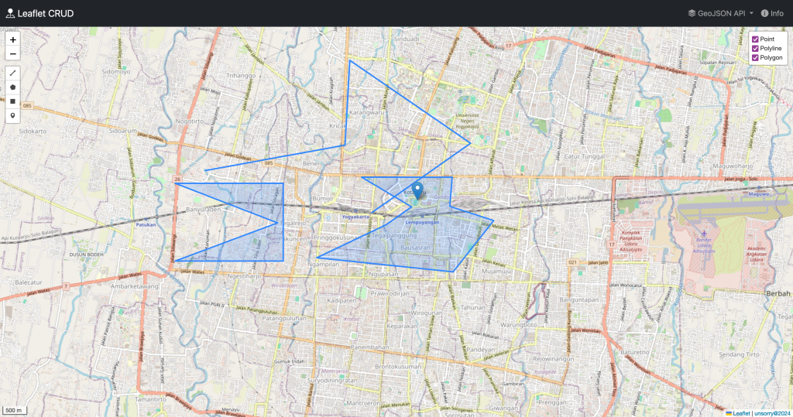
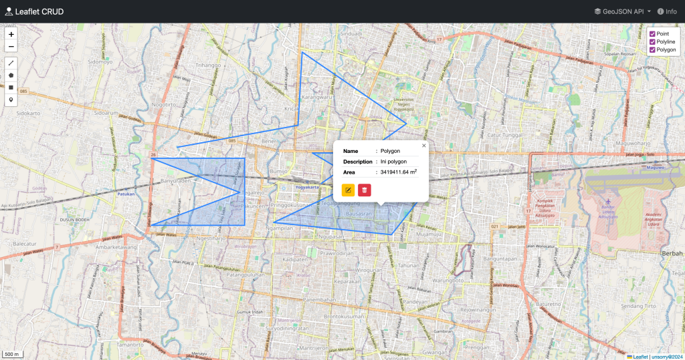
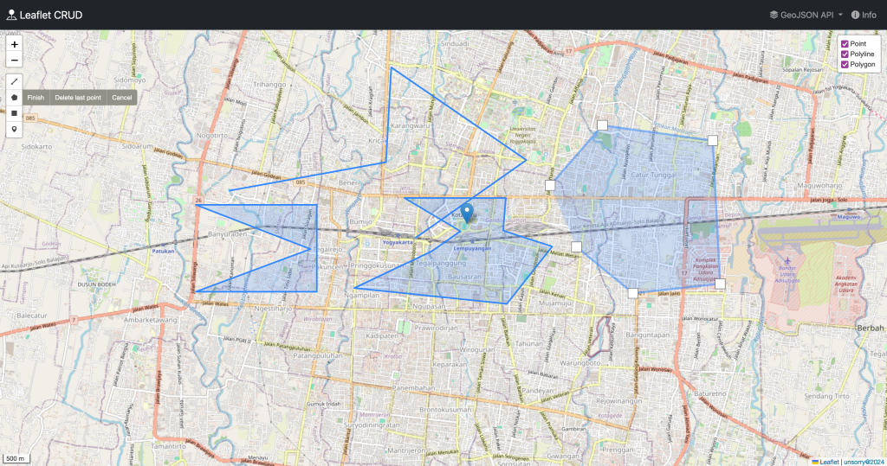
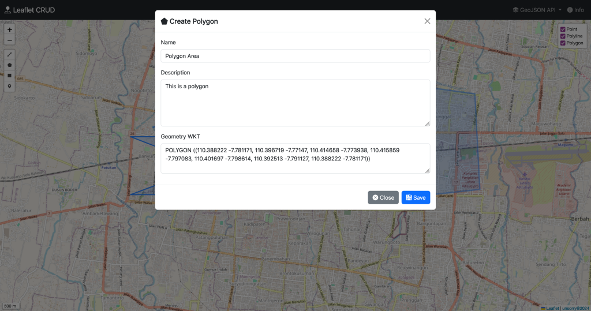
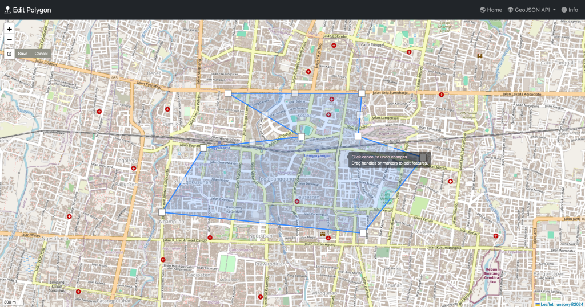
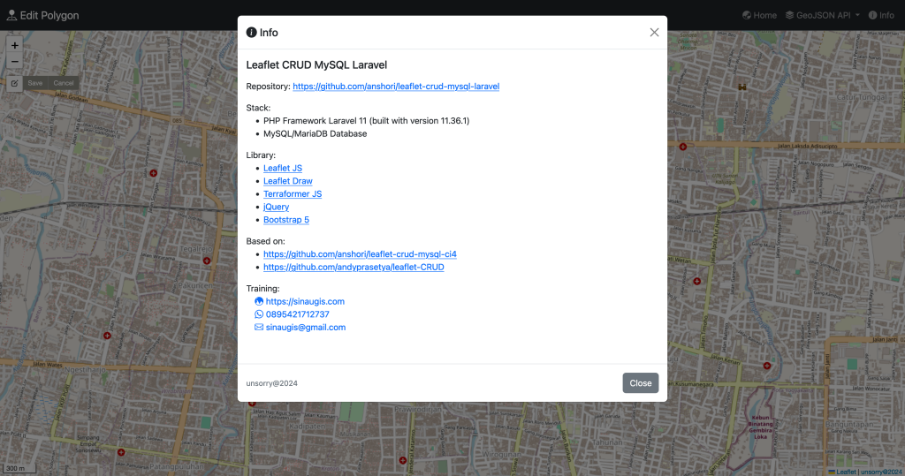

# Leaflet CRUD MySQL/MariaDB Laravel

## About Leaflet CRUD MySQL/MariaDB Laravel

Leaflet CRUD MySQL/MariaDB Laravel is a simple application that demonstrates how to create, read, update, and delete data spatial using Leaflet, MySQL/MariaDB, and Laravel.

## Features

- Leaflet map for displaying spatial data
- Leaflet draw for creating spatial data (point, line, polygon)
- Create, read, update, and delete data spatial (point, line, polygon)
- MySQL/MariaDB for storing spatial data
- GeoJSON API output for spatial data
- Calculate area for polygon
- Calculate length for line

## Screenshot

## Requirements

- PHP 8.2 or higher
- PHP Extensions: Ctype, cURL, DOM, Fileinfo, Filter, Hash, Mbstring, OpenSSL, PCRE, PDO, Session, Tokenizer, XML
- Composer
- Node.js
- NPM
- Database MySQL/MariaDB

[https://laravel.com/docs/11.x/deployment#server-requirements](https://laravel.com/docs/11.x/deployment#server-requirements)

## Installation

#### Manual Installation

- Clone the repository
- Create a new database
- Copy the `.env.example` file to `.env`
- Update the `.env` file with your database credentials
- Run `composer install`
- Run `npm install`
- Run `npm run build`
- Run `php artisan key:generate`
- Run `php artisan migrate`
- Run `php artisan storage:link`
- Run `php artisan serve`
- Visit `http://localhost:8000` in your browser

#### Makefile Installation

- Clone the repository
- Create a new database
- Copy the `.env.example` file to `.env`
- Update the `.env` file with your database credentials
- Run `make setup`
- Run `make dev`
- Visit `http://localhost:8000` in your browser

#### Docker Installation
- Clone the repository
- Copy the `.env.example` file to `.env`
- Update the `.env` file with your database credentials
- Update the `.env` parameter `DB_HOST` to `database`
- Run `composer install`
- Run `npm install`
- Run `npm run build`
- Run `docker-compose up -d`
- Run `docker-compose exec app php artisan key:generate`
- Run `docker-compose exec app php artisan migrate`
- Run `docker-compose exec app php artisan storage:link` if you want to use storage
- Run `docker-compose exec app php artisan optimize`
- Visit `http://localhost` in your browser

#### Training

Contact me at [m.anshory@gmail.com](mailto:m.anshory@gmail.com) or [sinaugis.com](https://sinaugis.com) or [SinauGIS Official: 0895-4217-12737](https://wa.me/0895421712737) for training.

___

> unsorry@2024